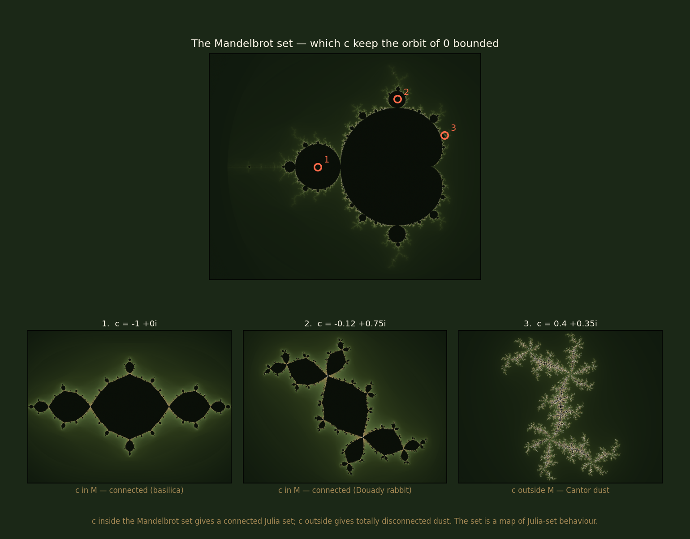

# Lucas' Super Mandelbrot Explorer (SMJExplorer)

An interactive visualization tool for exploring the Mandelbrot set, Julia sets, and fractal dynamics built with Python and Tkinter.



*Top: the Mandelbrot set, with three parameter values marked. Bottom: the Julia
set at each of them. The first two values lie inside the Mandelbrot set and
give connected Julia sets; the third lies outside and shatters into
disconnected dust. Regenerate with `python3 docs/render_gallery.py`.*

## Two ways to run it

There is a desktop app and a browser app. They share the mathematics and
nothing else — the desktop version draws through Tkinter, which cannot run on
a server, so the web version is a separate front end rather than a port.

### Desktop — `SMJExplorer.py`

```bash
git clone https://github.com/lucascarsonbrown/mandelbrot-set-explorer.git
cd mandelbrot-set-explorer
python3 SMJExplorer.py
```

No third-party dependencies at all: pure standard library, rendering through
Tkinter and a graphics layer included in the repo. You need Python 3 built with
Tkinter support, which ships with the python.org installers for macOS and
Windows; on Debian/Ubuntu it is a separate package (`sudo apt install
python3-tk`).

### Browser — `app.py`

```bash
pip install -r requirements.txt
streamlit run app.py
```

Two panels side by side. Click the Mandelbrot set to choose a parameter and the
Julia set for it renders immediately, with a verdict underneath saying whether
that parameter lies inside the set and therefore whether the Julia set is
connected. Also included: click-to-zoom on either panel, an iteration slider,
four palettes, period colouring of the bulbs, and presets for the named
parameters (Douady rabbit, basilica, dendrite, San Marco, Siegel disk, and one
outside the set for contrast).

Rendering is vectorised NumPy and cached per view, because a free hosting
container is one modest CPU and every widget change reruns the script. Note
that `escape_time` takes the Julia parameter as a `(re, im)` tuple rather than
a `complex` — Streamlit's cache cannot hash `complex`, and passing one throws
rather than silently degrading.

`docs/render_gallery.py` is documentation tooling for the image above, not part
of either app.

## Mathematical Background

### The Mandelbrot Set

The Mandelbrot set is one of the most famous and visually striking objects in mathematics. It is defined as the set of complex numbers `c` for which the iterative sequence:

```
z₀ = 0
z_{n+1} = z_n² + c
```

remains bounded (does not escape to infinity) as `n → ∞`.

#### Formal Definition

More precisely, the Mandelbrot set **M** is:

```
M = { c ∈ ℂ : lim_{n→∞} |z_n| ≠ ∞, where z₀ = 0 and z_{n+1} = z_n² + c }
```

In practice, we say that `c ∈ M` if there exists some finite bound `R` such that `|z_n| < R` for all `n`. A commonly used criterion is that if `|z_n| > 2` for some `n`, then the sequence will escape to infinity, so `c ∉ M`.

#### Escape-Time Algorithm

The visualization of the Mandelbrot set uses an escape-time algorithm:

1. For each point `c` in the complex plane (represented as pixels)
2. Iterate the function `z_{n+1} = z_n² + c` starting from `z₀ = 0`
3. Count how many iterations it takes for `|z_n|` to exceed the escape radius (typically 2)
4. If the sequence doesn't escape within a maximum number of iterations, consider `c` to be in the set
5. Color points based on their escape time (or black if they never escape)

The boundary of the Mandelbrot set exhibits infinite complexity—no matter how much you zoom in, you'll always find more intricate detail. This self-similarity at different scales is a hallmark of fractal geometry.

#### Period and Bulbs

The Mandelbrot set contains regions called "bulbs" where points have specific periodic behavior:

- The main cardioid contains points with period 1
- The circular bulb to the left has period 2
- Smaller bulbs have higher periods (3, 4, 5, ...)

For a point `c` in a period-`p` bulb, the iteration eventually enters a cycle of length `p`: there exists an `N` such that `z_{n+p} = z_n` for all `n > N`.

### Julia Sets

While the Mandelbrot set fixes the initial value (`z₀ = 0`) and varies the parameter `c`, Julia sets do the opposite: they fix the parameter `c` and vary the initial value `z₀`.

#### Formal Definition

For a fixed complex parameter `c`, the Julia set **J_c** is the boundary of the set of points `z₀` for which the iteration:

```
z_{n+1} = z_n² + c
```

remains bounded as `n → ∞`.

More formally:

```
J_c = ∂{ z₀ ∈ ℂ : lim_{n→∞} |z_n| ≠ ∞, where z_{n+1} = z_n² + c }
```

The filled Julia set **K_c** is the full set of bounded points (not just the boundary):

```
K_c = { z₀ ∈ ℂ : lim_{n→∞} |z_n| ≠ ∞, where z_{n+1} = z_n² + c }
```

#### Connection to the Mandelbrot Set

There is a profound relationship between the Mandelbrot set and Julia sets:

- If `c ∈ M` (c is in the Mandelbrot set), then the Julia set **J_c** is **connected**—it forms a single piece
- If `c ∉ M` (c is outside the Mandelbrot set), then the Julia set **J_c** is a **Cantor dust**—a totally disconnected fractal

This means the Mandelbrot set is actually a "map" of all possible Julia set behaviors! Each point in the Mandelbrot set corresponds to a different connected Julia set shape, while points outside correspond to disconnected dust-like Julia sets.

#### Visualization

Like the Mandelbrot set, Julia sets are typically visualized using escape-time coloring:

1. For each point `z₀` in the complex plane
2. Iterate `z_{n+1} = z_n² + c` (with `c` fixed)
3. Count iterations until `|z_n| > 2`
4. Color based on escape time

Different values of `c` produce dramatically different Julia set shapes:
- `c = 0` produces a perfect circle
- `c = -1` produces a fractal dendrite
- Values near the boundary of the Mandelbrot set produce the most intricate Julia sets

### Dynamical Systems Perspective

Both the Mandelbrot and Julia sets arise from the study of discrete dynamical systems. The iteration `f_c(z) = z² + c` defines a dynamical system on the complex plane. The behavior of orbits under repeated application of `f_c` determines the structure of these sets.

Key concepts:
- **Orbit**: The sequence `z₀, f_c(z₀), f_c(f_c(z₀)), ...`
- **Attractor**: A set that orbits approach over time
- **Repeller**: A set that orbits move away from
- **Periodic point**: A point where `f_c^n(z) = z` for some `n`

The Julia set **J_c** is the boundary between points that escape to infinity and points that remain bounded—it's the chaotic regime where small changes in initial conditions lead to drastically different long-term behavior.

## Features

- **Mandelbrot Set Visualization**: Interactive rendering of the Mandelbrot set with customizable iterations
- **Julia Set Exploration**: Visualize Julia sets for any point in the complex plane
- **Multiple Rendering Modes**:
  - Standard Mandelbrot set (MB)
  - Julia set (JS)
  - Filled Julia set (FJS)
  - Julia set with escape-time coloring (JSE)
  - Period-colored Mandelbrot set (PCMB)
- **Zoom Functionality**: Zoom in and out on both Mandelbrot and Julia sets to explore fractal detail at any scale
- **Interactive Point Selection**: Click on the Mandelbrot set to select parameter values for Julia sets and see the connection between the two
- **Period Calculation**: Calculate the period of points in the Mandelbrot set to understand the structure of bulbs
- **Custom UI**: Clean, colorful interface with control panel

## Usage

### Controls

- **Exit**: Close the application
- **Help**: Open the custom GPT helper (requires internet connection)
- **Clear**: Clear both the Mandelbrot and Julia set displays
- **Get C Value**: Click on the Mandelbrot set to select a parameter for the Julia set
- **Set C Value**: Manually enter real and imaginary components for the Julia set parameter
- **Get Period**: Calculate the period of the current selected point
- **Plot MB**: Draw the standard Mandelbrot set
- **Plot JS**: Draw the Julia set
- **Plot FJS**: Draw the filled Julia set
- **Plot JSE**: Draw the Julia set with escape-time coloring
- **Plot PCMB**: Draw the period-colored Mandelbrot set
- **Zoom +**: Zoom in on either the Mandelbrot or Julia set windows
  1. Click the "Zoom +" button
  2. Click on one corner of the area you want to zoom into
  3. Click on the opposite corner to define the rectangle
  4. A rectangle will appear showing your selection
  5. Click inside the rectangle to zoom in to that region
- **Zoom -**: Zoom out to see a wider view
- **Iterations Slider**: Adjust the maximum number of iterations for rendering

## Publishing the browser app

Streamlit Community Cloud hosts Python apps at a public `*.streamlit.app` URL.
GitHub Pages cannot — it serves static files and this app needs a Python
process.

1. Sign in to [Streamlit Community Cloud](https://share.streamlit.io/) with GitHub.
2. **Create app** → repository `lucascarsonbrown/mandelbrot-set-explorer`,
   branch `main`, entrypoint `app.py`.
3. Under advanced settings choose Python **3.11**. No secrets are needed.
4. Deploy, then put the assigned URL at the top of this README and in the
   repository's **About → Website** field.

The host installs `requirements.txt` and reads `.streamlit/config.toml`. Later
pushes to `main` redeploy automatically.

## File Structure

- `SMJExplorer.py` - Desktop application (Tkinter)
- `app.py` - Browser application (Streamlit)
- `base_graphics.py` - Core graphics library (based on John Zelle's graphics.py)
- `widgets.py` - Widget library for GUI components
- `utils.py` - Utility functions
- `FracUtils.py` - Utilities for fractal drawing
- `polygon.py` - Polygon graphics class
- `SMJExplorerBackgroundResized.png` - Background image for title bar
- `docs/render_gallery.py` - Generates the README image (NumPy/Matplotlib; not used by the app)

## Credits

This project uses graphics libraries originally created by **JS Iwanski** for the NonLinear Dynamics course at Dwight-Englewood School. The `base_graphics.py` and `widgets.py` files are based on his design and implementation.

The original graphics library was itself based on John Zelle's graphics.py module from "Python Programming: An Introduction to Computer Science" (Franklin, Beedle & Associates).

